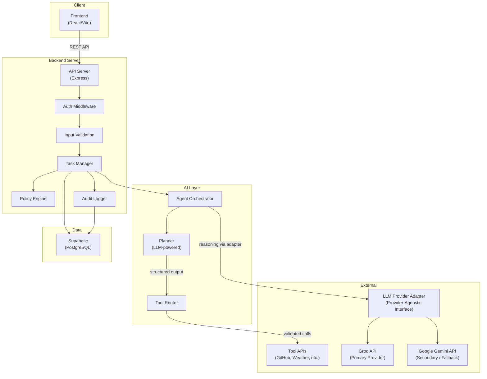
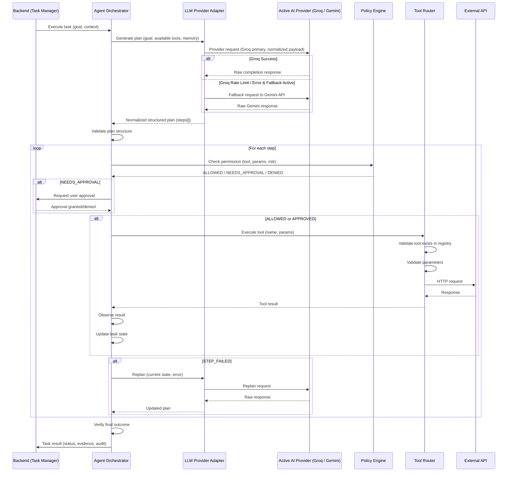
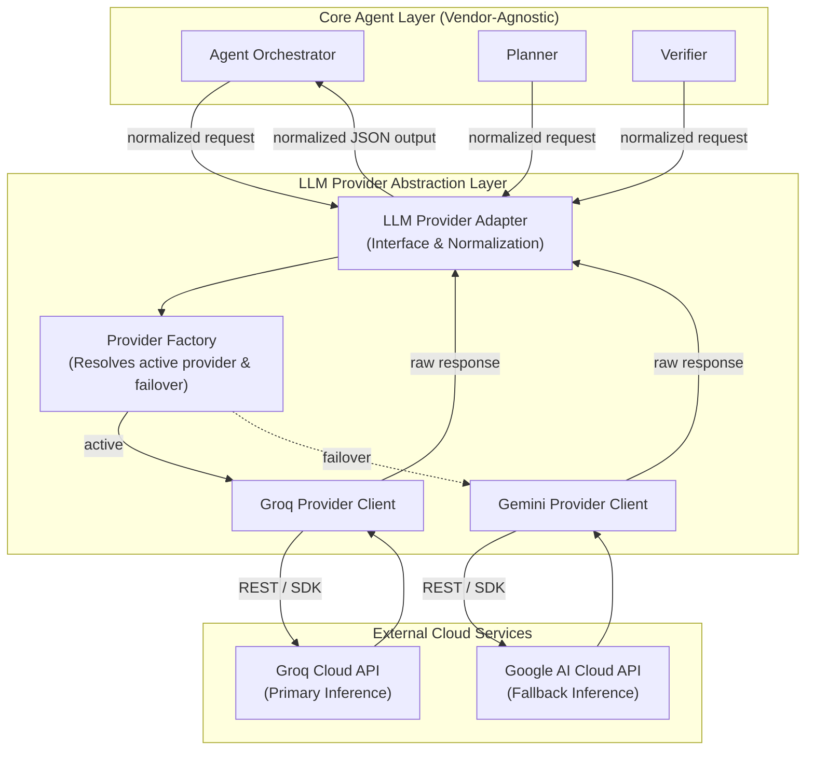
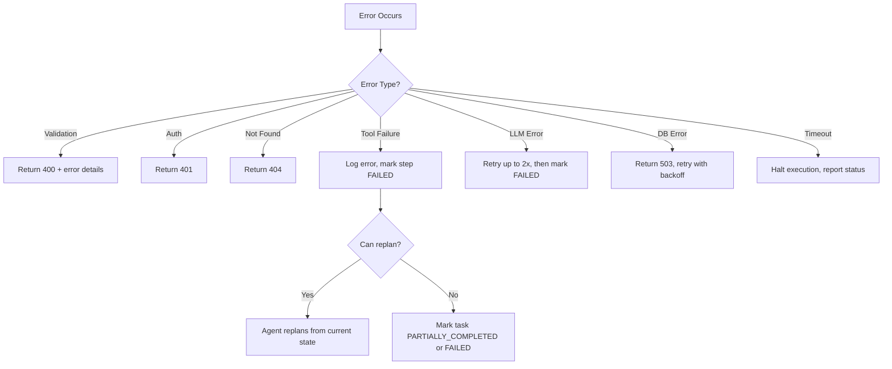
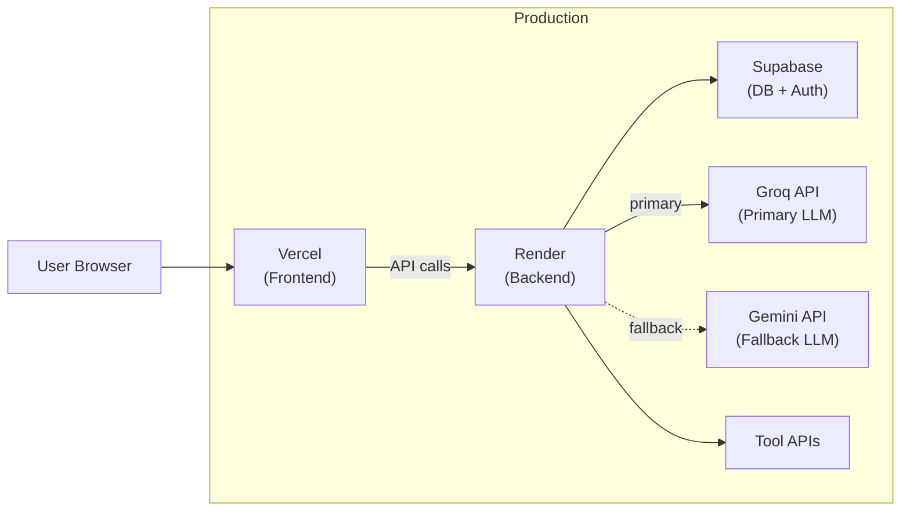

# System Architecture — AURA

> **Status**: `PROPOSED` — Architecture defined, pending team approval before implementation.

---

## 1. Architecture Goals

1. **Simple & reliable** — Minimal moving parts for 36-hour hackathon
2. **Clear boundaries** — Each team member owns a distinct layer
3. **Contract-driven** — All interfaces documented before implementation
4. **Secure** — LLM cannot bypass application-level security
5. **Observable** — Every agent action is traceable
6. **Demo-ready** — Optimized for reliable live demonstration
7. **Independently developable** — Frontend, backend, AI can be built in parallel

**Status**: `DECIDED`

---

## 2. Design Principles

| Principle | Rule |
|-----------|------|
| Deterministic > Probabilistic | Security, permissions, validation use deterministic logic. LLM used only for reasoning/planning. |
| Contract-first | API contract defined before implementation. No ad-hoc endpoints. |
| Fail-safe | On error, halt and report rather than guess and continue. |
| Observable | Every agent action produces an auditable record. |
| Minimal | No unnecessary services, databases, abstractions, or dependencies. |
| Provider-flexible | LLM and external APIs are behind abstraction layers. Swapping providers should not require rewriting the application. |

---

## 3. System Boundaries

```
┌─────────────────────────────────────────────────────┐
│                    FRONTEND                          │
│  (React/Vite — Manoj)                               │
│  Dashboard, Task UI, Plan Viewer, Approval UI       │
│  Audit Log Viewer                                   │
└──────────────────────┬──────────────────────────────┘
                       │ HTTP REST API
                       │ (documented contract)
┌──────────────────────▼──────────────────────────────┐
│                    BACKEND                           │
│  (Node.js/Express — Abishek)                        │
│  API Server, Auth, Validation, Task Manager,        │
│  Policy Engine, Audit Logger                        │
└───┬──────────────┬──────────────┬───────────────────┘
    │              │              │
    ▼              ▼              ▼
┌────────┐  ┌────────────┐  ┌─────────────┐
│DATABASE│  │ AI/AGENT   │  │ EXTERNAL    │
│Supabase│  │ LAYER      │  │ TOOL APIs   │
│(Abishek│  │(Bala)      │  │(registered) │
│  +Bala)│  │Orchestrator│  │             │
└────────┘  │Planner     │  └─────────────┘
            │Tool Router │
            └────────────┘
```

**Owner boundaries**: `DECIDED`

| Component | Primary Owner | Support |
|-----------|--------------|---------|
| Frontend | Manoj | Kamal (integration) |
| Backend API | Abishek | Bala (AI endpoints) |
| Database | Abishek | Bala (schema input) |
| AI/Agent Layer | Bala | Abishek (API integration) |
| Testing | Elango | All members |
| Deployment | Elango | Kamal (coordination) |
| Integration | Kamal | Elango |

---

## 4. High-Level Architecture Diagram



---

## 5. Frontend Architecture

**Owner**: Manoj

### Purpose

Provide the user interface for goal submission, plan visualization, real-time execution monitoring, approval handling, and audit trail viewing.

### Responsibilities

- Render task dashboard
- Accept natural-language goal input
- Display agent-generated plans
- Show real-time step execution status
- Present approval requests
- Display verification results
- Show audit trail
- Handle loading, empty, error, and success states

### Technology

| Choice | Value | Status |
|--------|-------|--------|
| Framework | React (via Vite) | `PROPOSED` |
| Language | JavaScript/JSX | `PROPOSED` |
| Styling | Vanilla CSS with design tokens | `PROPOSED` |
| State management | React useState/useReducer + Context | `PROPOSED` |
| HTTP client | fetch API | `PROPOSED` |
| Real-time updates | Polling (SSE as stretch) | `PROPOSED` |

### Inputs

- User interactions (goal text, approval decisions, navigation)
- API responses from backend (task state, step results, audit data)

### Outputs

- HTTP requests to backend API
- Visual rendering of all task states

### Dependencies

- Backend API (via documented contract in `docs/03-API-CONTRACT.md`)
- Design system (via `docs/04-DESIGN-SYSTEM.md`)

### Failure Modes

| Failure | Handling |
|---------|----------|
| API unreachable | Show error state with retry option |
| Invalid API response | Show error, log to console |
| Slow response | Show loading state, timeout after 30s |
| Auth expired | Redirect to login |

### Security Concerns

- Never store secrets in frontend code
- Never display raw API keys or tokens
- Sanitize any user-generated content displayed

### Testing Strategy

- Component rendering tests
- API integration tests with mock backend
- Manual responsive testing

---

## 6. Backend Architecture

**Owner**: Abishek

### Purpose

Serve as the central API server, handling authentication, authorization, task management, policy enforcement, and database operations.

### Responsibilities

- Expose documented REST API endpoints
- Authenticate and authorize requests
- Validate all inputs
- Manage task lifecycle (create, update, complete, fail)
- Enforce policy engine rules (risk classification, approval requirements)
- Coordinate with AI layer for planning and execution
- Log all actions to audit trail
- Serve tool execution results to frontend

### Technology

| Choice | Value | Status |
|--------|-------|--------|
| Runtime | Node.js (v18+) | `PROPOSED` |
| Framework | Express.js | `PROPOSED` |
| Language | JavaScript | `PROPOSED` |
| Validation | Joi or Zod | `PROPOSED` |
| Auth | Supabase Auth (JWT verification) | `PROPOSED` |
| Environment | dotenv for env vars | `PROPOSED` |

### Inputs

- HTTP requests from frontend
- Tool execution results from AI layer
- Database query results

### Outputs

- JSON API responses to frontend
- Database writes (tasks, steps, audit logs)
- Requests to AI layer

### Dependencies

- Database (Supabase/PostgreSQL)
- AI layer (for planning and execution)
- External tool APIs (via AI layer tool router)

### Failure Modes

| Failure | Handling |
|---------|----------|
| Database connection fails | Return 503, retry with backoff |
| AI layer timeout | Mark task step as FAILED, allow replan |
| External API error | Log error, return structured failure to task manager |
| Invalid request | Return 400 with validation errors |
| Auth failure | Return 401 |

### Security Concerns

- All inputs validated before processing
- All database queries parameterized
- No secrets in responses
- Rate limiting on task creation
- CORS configured for frontend origin only

### Testing Strategy

- Unit tests for validation logic
- API endpoint tests
- Integration tests with database
- Policy engine tests

---

## 7. Agent Orchestration Architecture

**Owner**: Bala Subramanian V

### Purpose

Coordinate the AI reasoning loop: receive a goal, generate a plan, execute tools, observe results, adapt, and verify outcomes.

### Architecture



### Key Components

#### 7.1 Agent Orchestrator

| Aspect | Detail |
|--------|--------|
| **Purpose** | Main execution loop — coordinates planning, execution, and verification |
| **Input** | Task goal, available tools, user context, memory |
| **Output** | Task result with status, step results, audit entries |
| **Logic type** | DETERMINISTIC control flow with LLM-powered decision points |

#### 7.2 Planner

| Aspect | Detail |
|--------|--------|
| **Purpose** | Use LLM to decompose a goal into executable steps |
| **Input** | Goal text, available tool descriptions, relevant memory |
| **Output** | Structured plan: `{ steps: [{ tool, params, description, risk }] }` |
| **Logic type** | LLM-BASED — output must be validated against schema |
| **Validation** | Every plan validated: tool exists, params match schema, risk classified |

#### 7.3 Tool Registry

| Aspect | Detail |
|--------|--------|
| **Purpose** | Define available tools with name, description, parameters, risk level |
| **Implementation** | Static configuration (JSON/JS object) — not LLM-generated |
| **Logic type** | DETERMINISTIC — tools cannot be invented by the LLM |

#### 7.4 Tool Router

| Aspect | Detail |
|--------|--------|
| **Purpose** | Execute a validated tool call against the real API |
| **Input** | Tool name, validated parameters |
| **Output** | Structured result: `{ success, data, error }` |
| **Logic type** | DETERMINISTIC — HTTP calls with timeout and error handling |

#### 7.5 Policy Engine

| Aspect | Detail |
|--------|--------|
| **Purpose** | Classify risk and enforce permissions |
| **Input** | Tool name, parameters, user context |
| **Output** | Decision: ALLOWED / NEEDS_APPROVAL / DENIED |
| **Logic type** | DETERMINISTIC — rule-based, not LLM-decided |
| **Critical rule** | LLM MUST NOT be the sole authority on permission decisions |

---

## 8. Deterministic vs. LLM-Based Logic

> **Critical architectural rule**: Security-sensitive decisions MUST use deterministic logic.

| Function | Logic Type | Justification |
|----------|-----------|---------------|
| Input validation | DETERMINISTIC | Security |
| Authentication | DETERMINISTIC | Security |
| Authorization | DETERMINISTIC | Security |
| Risk classification | DETERMINISTIC | Security |
| Permission checking | DETERMINISTIC | Security |
| Tool registry | DETERMINISTIC | Security |
| Parameter validation | DETERMINISTIC | Security |
| Goal understanding | LLM-BASED | Requires natural language understanding |
| Plan generation | LLM-BASED | Requires reasoning about task decomposition |
| Result interpretation | LLM-BASED | Requires understanding tool output semantics |
| Replanning | LLM-BASED | Requires reasoning about alternatives |
| Verification reasoning | LLM-BASED | May need to interpret whether a result matches the goal |
| Summary generation | LLM-BASED | Natural language output |

**Status**: `DECIDED`

---

## 9. LLM / Model Layer (Provider-Agnostic Adapter Architecture)

### 9.1 Core Principle

The AURA Reasoning Engine, Planner, and Verifier must **never directly depend on vendor-specific code or proprietary API structures**. All LLM interactions flow strictly through a unified **LLM Provider Adapter** layer that abstracts model invocation, prompt serialization, tool definition mapping, and response parsing.

### 9.2 Provider Hierarchy

| Role | Provider | Justification | Configuration | Status |
|------|----------|---------------|---------------|--------|
| **Primary** | **Groq API** | Ultra-low inference latency via LPU hardware, generous hackathon developer limits, fast multi-step planning loops, OpenAI-compatible schema | `AI_PROVIDER=groq`<br/>`GROQ_API_KEY`<br/>`GROQ_MODEL` (configurable, TBD) | `DECIDED` (Primary) |
| **Secondary / Fallback** | **Google Gemini API** | High availability backup, large context window, multimodal capability, resilient failover | `AI_PROVIDER=gemini`<br/>`GEMINI_API_KEY`<br/>`GEMINI_MODEL` (configurable, TBD) | `DECIDED` (Fallback) |

> **IMPORTANT**: Exact production models for both Groq and Gemini are **TBD** and must not be hardcoded in application logic. Model IDs are injected via environment variables (`GROQ_MODEL`, `GEMINI_MODEL`).

### 9.3 Unified Adapter Architecture



### 9.4 Failover & Resilience Mechanism

1. **Active Provider Selection**: The active provider is determined by `AI_PROVIDER` (default: `groq`).
2. **Deterministic Failover Loop**:
   - If the primary provider (Groq) returns a rate-limit error (`429 Too Many Requests`), server error (`5xx`), or request timeout, and `AI_ENABLE_FALLBACK=true`:
     - The adapter catches the error and logs a warning with provider metadata.
     - The adapter automatically routes the identical normalized prompt/tool payload to the fallback provider (Gemini).
     - The event is logged in the deterministic audit trail (`audit_logs`) noting provider switchover.
   - If both providers fail (or fallback is disabled), a structured `LLM_PROVIDER_ERROR` is raised, transitioning the task to a recoverable or failed state with clear diagnostic evidence.
3. **Output Normalization**:
   - Both provider clients translate raw responses into a canonical AURA response schema:
     ```json
     {
       "content": "string response",
       "tool_calls": [
         {
           "tool_name": "string",
           "parameters": {}
         }
       ],
       "provider": "groq" | "gemini",
       "model": "model-id-string",
       "usage": { "prompt_tokens": 0, "completion_tokens": 0, "total_tokens": 0 }
     }
     ```
   - Invalid JSON structures trigger up to 2 retries before escalating.

**Status**: `DECIDED` (Adapter Pattern & Multi-Provider Hierarchy), `PROPOSED` (Specific Model IDs TBD)

---

## 10. Database

| Aspect | Detail | Status |
|--------|--------|--------|
| Technology | Supabase (PostgreSQL) | `PROPOSED` |
| Purpose | Persist tasks, steps, audit logs, tool definitions, memory | `DECIDED` |
| Auth | Supabase Auth for user authentication | `PROPOSED` |
| Access | Server-side only via service role key | `DECIDED` |

See `docs/05-DATABASE.md` for complete schema.

---

## 11. Authentication & Authorization

### Authentication

| Aspect | Detail | Status |
|--------|--------|--------|
| Method | Supabase Auth (email/password or magic link) | `PROPOSED` |
| Token | JWT issued by Supabase | `PROPOSED` |
| Frontend | Stores JWT, sends in Authorization header | `PROPOSED` |
| Backend | Validates JWT on every request | `PROPOSED` |
| MVP simplification | For MVP, may use a single demo user with pre-set credentials | `TBD` |

### Authorization

| Aspect | Detail | Status |
|--------|--------|--------|
| Model | Users can only access their own tasks | `DECIDED` |
| Enforcement | Backend checks user_id on every database query | `DECIDED` |
| Agent actions | Scoped to the requesting user's permissions | `DECIDED` |

---

## 12. Audit Logging

| Aspect | Detail |
|--------|--------|
| **Purpose** | Record every agent action for transparency and debugging |
| **What is logged** | Task creation, plan generation, tool execution, approval requests/decisions, errors, verification results |
| **Where** | `audit_logs` table in database |
| **Access** | User can view their own audit trail via API |
| **Retention** | Persist for hackathon duration |

**Status**: `DECIDED`

---

## 13. Error Handling Strategy



---

## 14. External Services

| Service | Purpose | Free Tier | Status |
|---------|---------|-----------|--------|
| Groq API | Primary LLM reasoning & fast plan generation | Yes (Developer tier, high TPS) | `PROPOSED` |
| Google Gemini API | Secondary / Fallback LLM reasoning & planning | Yes (rate-limited free tier) | `PROPOSED` |
| Supabase | Database + Auth | Yes (500MB, 50k rows) | `PROPOSED` |
| OpenWeatherMap API | Example tool (weather data) | Yes (1000 calls/day) | `PROPOSED` |
| GitHub API | Example tool (repo data) | Yes (60 req/hr unauth, 5000 auth) | `PROPOSED` |
| JSONPlaceholder | Example tool (mock CRUD) | Yes (unlimited) | `PROPOSED` |

> **DECISION REQUIRED**: Final tool APIs depend on chosen demo use case (see `docs/01-PROJECT-OVERVIEW.md` Section 14).

---

## 15. Deployment Topology



See `docs/07-DEPLOYMENT.md` for full deployment plan.

---

## 16. Folder Structure

```
VIT-HackBattle-Project/
├── frontend/                    # React/Vite app (Manoj)
│   ├── src/
│   │   ├── components/          # Reusable UI components
│   │   ├── pages/               # Page-level components
│   │   ├── hooks/               # Custom React hooks
│   │   ├── services/            # API client functions
│   │   ├── utils/               # Helper utilities
│   │   ├── styles/              # Global CSS + design tokens
│   │   ├── App.jsx
│   │   └── main.jsx
│   ├── public/
│   ├── index.html
│   ├── vite.config.js
│   └── package.json
│
├── backend/                     # Express server (Abishek)
│   ├── src/
│   │   ├── routes/              # API route handlers
│   │   ├── middleware/          # Auth, validation, error handling
│   │   ├── services/           # Business logic
│   │   ├── models/             # Database queries/models
│   │   ├── config/             # Configuration, env parsing
│   │   ├── utils/              # Helper utilities
│   │   └── server.js           # Entry point
│   ├── .env.example
│   └── package.json
│
├── agent/                       # AI/Agent layer (Bala)
│   ├── src/
│   │   ├── orchestrator.js     # Main agent execution loop
│   │   ├── planner.js          # Plan generation logic
│   │   ├── providers/          # LLM Provider Abstraction Layer
│   │   │   ├── index.js        # Provider factory & fallback manager
│   │   │   ├── baseProvider.js # Abstract provider interface
│   │   │   ├── groqProvider.js # Groq API implementation (Primary)
│   │   │   └── geminiProvider.js # Gemini API implementation (Fallback)
│   │   ├── toolRegistry.js     # Tool definitions
│   │   ├── toolRouter.js       # Tool execution
│   │   ├── policyEngine.js     # Permission/risk rules
│   │   ├── memory.js           # Memory management
│   │   └── prompts/            # LLM prompt templates
│   └── package.json
│
├── shared/                      # Shared constants/types
│   └── taskStates.js           # Canonical task state definitions
│
├── docs/                        # Documentation (source of truth)
├── .agents/                     # Agent skills
├── AGENTS.md
├── README.md
└── .gitignore
```

**Status**: `PROPOSED` — May be adjusted. The `agent/` module may be integrated into `backend/` if the team prefers a simpler structure.

> **DECISION REQUIRED**: Should the agent layer be a separate directory (`agent/`) or a subdirectory within `backend/` (e.g., `backend/src/agent/`)? Separate directory is recommended for ownership clarity.

---

## 17. Architecture Risks

| Risk | Impact | Mitigation |
|------|--------|------------|
| LLM returns malformed plans | Execution breaks | Strict JSON schema validation |
| LLM hallucinates tools that don't exist | Invalid execution attempt | Validate against tool registry |
| External API rate limits during demo | Demo fails | Cache demo data, pre-test timing |
| Supabase cold start | Slow first request | Warm up before demo |
| CORS misconfiguration | Frontend can't reach backend | Test early, document exact config |
| Token expiry during demo | Auth fails mid-demo | Use long-lived demo tokens |

---

## 18. Architecture Rules

1. Do not introduce unnecessary technologies
2. Do not duplicate business logic across frontend and backend
3. Keep API contracts explicit and documented
4. Keep secrets out of frontend code
5. Keep database access controlled (server-side only)
6. Follow the project's defined API contract
7. Changes affecting architecture must update this document
8. LLM must not control security-critical decisions without deterministic enforcement
9. All tool executions must go through the tool registry and policy engine
10. Every agent action must produce an audit log entry