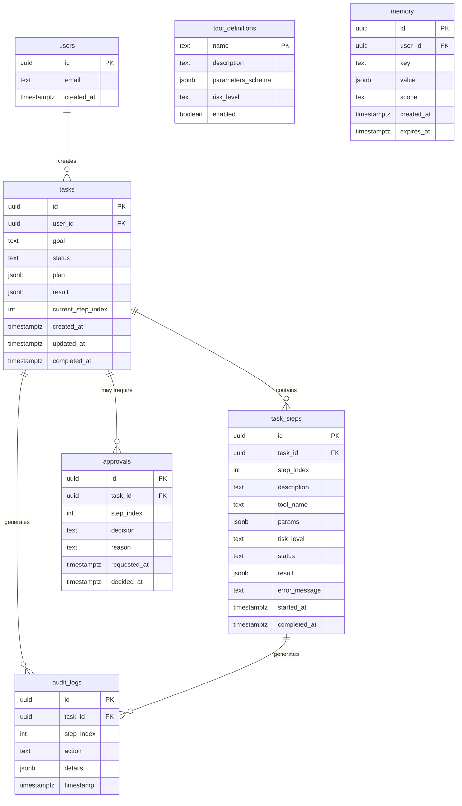

# Database Design — AURA

> **Status**: `PROPOSED` — Schema designed, pending team approval.

---

## 1. Database Technology Selection

### Recommendation: Supabase (PostgreSQL)

| Criterion | Supabase (PostgreSQL) | SQLite | MongoDB Atlas |
|-----------|----------------------|--------|---------------|
| **Free tier** | ✅ 500MB, 50k rows, 500k edge function invocations | ✅ Free (local) | ✅ 512MB |
| **Relational support** | ✅ Full SQL | ✅ Full SQL | ❌ Document-based |
| **Auth built-in** | ✅ Supabase Auth | ❌ None | ❌ None |
| **Managed hosting** | ✅ Cloud-hosted | ❌ Local only | ✅ Cloud-hosted |
| **Realtime** | ✅ Built-in subscriptions | ❌ None | ❌ Change streams (complex) |
| **Row-Level Security** | ✅ Native | ❌ Application-level | ❌ Application-level |
| **Development speed** | ★★★★☆ | ★★★★★ | ★★★☆☆ |
| **Hackathon suitability** | ★★★★★ | ★★★☆☆ (no cloud) | ★★★☆☆ |

**Chosen**: Supabase (PostgreSQL)

**Justification**:
- Provides database + auth + realtime in a single free-tier service
- PostgreSQL gives proper relational modeling for task/step/audit relationships
- Row-Level Security aligns with AURA's per-user task isolation
- Cloud-hosted eliminates deployment complexity
- REST and JS client SDK available

**Status**: `PROPOSED`

---

## 2. Entity-Relationship Diagram

---

## 3. Table Definitions

### 3.1 `users`

> **Note**: Managed by Supabase Auth. This table is `auth.users` in Supabase. Application code references `user_id` from the JWT.

| Column | Type | Nullable | Default | Constraints | Purpose |
|--------|------|----------|---------|-------------|---------|
| `id` | `uuid` | No | auto | PK | Unique user ID |
| `email` | `text` | No | — | Unique | User email |
| `created_at` | `timestamptz` | No | `now()` | — | Registration time |

**Security**: Managed by Supabase Auth. Do not store passwords in application tables.

---

### 3.2 `tasks`

| Column | Type | Nullable | Default | Constraints | Purpose |
|--------|------|----------|---------|-------------|---------|
| `id` | `uuid` | No | `gen_random_uuid()` | PK | Unique task ID |
| `user_id` | `uuid` | No | — | FK → auth.users(id) | Task owner |
| `goal` | `text` | No | — | max 1000 chars | User's goal text |
| `status` | `text` | No | `'QUEUED'` | CHECK (valid status) | Current task state |
| `plan` | `jsonb` | Yes | `null` | — | Generated plan (steps array) |
| `result` | `jsonb` | Yes | `null` | — | Final task result |
| `current_step_index` | `integer` | Yes | `null` | — | Index of currently executing step |
| `created_at` | `timestamptz` | No | `now()` | — | Creation time |
| `updated_at` | `timestamptz` | No | `now()` | — | Last update time |
| `completed_at` | `timestamptz` | Yes | `null` | — | Completion time |

**Indexes**:
- `idx_tasks_user_id` on `user_id`
- `idx_tasks_status` on `status`
- `idx_tasks_created_at` on `created_at DESC`

**Valid status values**: `QUEUED`, `PLANNING`, `AWAITING_APPROVAL`, `EXECUTING`, `OBSERVING`, `REPLANNING`, `VERIFYING`, `COMPLETED`, `PARTIALLY_COMPLETED`, `FAILED`, `CANCELLED`

**RLS Policy**: Users can only SELECT, UPDATE their own tasks (`user_id = auth.uid()`).

---

### 3.3 `task_steps`

| Column | Type | Nullable | Default | Constraints | Purpose |
|--------|------|----------|---------|-------------|---------|
| `id` | `uuid` | No | `gen_random_uuid()` | PK | Unique step ID |
| `task_id` | `uuid` | No | — | FK → tasks(id) ON DELETE CASCADE | Parent task |
| `step_index` | `integer` | No | — | — | Order of step in plan |
| `description` | `text` | No | — | — | Human-readable step description |
| `tool_name` | `text` | No | — | — | Tool to execute |
| `params` | `jsonb` | Yes | `'{}'` | — | Tool parameters |
| `risk_level` | `text` | No | `'LOW'` | CHECK (LOW, MEDIUM, HIGH) | Risk classification |
| `status` | `text` | No | `'PENDING'` | CHECK (valid status) | Step execution state |
| `result` | `jsonb` | Yes | `null` | — | Tool execution result |
| `error_message` | `text` | Yes | `null` | — | Error details if failed |
| `started_at` | `timestamptz` | Yes | `null` | — | Execution start time |
| `completed_at` | `timestamptz` | Yes | `null` | — | Execution end time |

**Indexes**:
- `idx_task_steps_task_id` on `task_id`
- Unique constraint on `(task_id, step_index)`

**Valid step status values**: `PENDING`, `EXECUTING`, `COMPLETED`, `FAILED`, `SKIPPED`, `AWAITING_APPROVAL`, `APPROVED`, `REJECTED`

---

### 3.4 `approvals`

| Column | Type | Nullable | Default | Constraints | Purpose |
|--------|------|----------|---------|-------------|---------|
| `id` | `uuid` | No | `gen_random_uuid()` | PK | Unique approval ID |
| `task_id` | `uuid` | No | — | FK → tasks(id) ON DELETE CASCADE | Parent task |
| `step_index` | `integer` | No | — | — | Step requiring approval |
| `decision` | `text` | Yes | `null` | CHECK (APPROVED, REJECTED, null) | User's decision |
| `reason` | `text` | Yes | `null` | — | Optional reason |
| `requested_at` | `timestamptz` | No | `now()` | — | When approval was requested |
| `decided_at` | `timestamptz` | Yes | `null` | — | When decision was made |

**Indexes**:
- `idx_approvals_task_id` on `task_id`

---

### 3.5 `audit_logs`

| Column | Type | Nullable | Default | Constraints | Purpose |
|--------|------|----------|---------|-------------|---------|
| `id` | `uuid` | No | `gen_random_uuid()` | PK | Unique log entry ID |
| `task_id` | `uuid` | No | — | FK → tasks(id) ON DELETE CASCADE | Parent task |
| `step_index` | `integer` | Yes | `null` | — | Associated step (if applicable) |
| `action` | `text` | No | — | — | Action type (see API contract) |
| `details` | `jsonb` | Yes | `'{}'` | — | Additional details |
| `timestamp` | `timestamptz` | No | `now()` | — | When the action occurred |

**Indexes**:
- `idx_audit_logs_task_id` on `task_id`
- `idx_audit_logs_timestamp` on `timestamp DESC`

**Security**: Audit logs are append-only. Application code should never UPDATE or DELETE audit entries.

---

### 3.6 `tool_definitions`

| Column | Type | Nullable | Default | Constraints | Purpose |
|--------|------|----------|---------|-------------|---------|
| `name` | `text` | No | — | PK | Unique tool identifier |
| `description` | `text` | No | — | — | Human-readable description |
| `parameters_schema` | `jsonb` | No | `'{}'` | — | Parameter schema for validation |
| `risk_level` | `text` | No | `'LOW'` | CHECK (LOW, MEDIUM, HIGH, DISALLOWED) | Default risk level |
| `enabled` | `boolean` | No | `true` | — | Whether tool is active |

> **Note**: Tool definitions may alternatively be stored as a static configuration file in the agent module rather than in the database. `TBD` — Team should decide whether database or file-based tool registry is more appropriate for the hackathon.

---

### 3.7 `memory` (P1 — Stretch)

| Column | Type | Nullable | Default | Constraints | Purpose |
|--------|------|----------|---------|-------------|---------|
| `id` | `uuid` | No | `gen_random_uuid()` | PK | Unique memory ID |
| `user_id` | `uuid` | No | — | FK → auth.users(id) | Memory owner |
| `key` | `text` | No | — | — | Memory key/label |
| `value` | `jsonb` | No | — | — | Stored information |
| `scope` | `text` | No | `'task'` | CHECK (task, user) | Memory scope |
| `created_at` | `timestamptz` | No | `now()` | — | Creation time |
| `expires_at` | `timestamptz` | Yes | `null` | — | Auto-expiry (null = no expiry) |

**Indexes**:
- `idx_memory_user_id` on `user_id`
- `idx_memory_key` on `key`

**Status**: `PROPOSED` — Only implement if time allows (P1).

---

## 4. Data Lifecycle

### Persistent State (in database)

| Data | Table | Persistence |
|------|-------|-------------|
| Tasks | `tasks` | Permanent (hackathon duration) |
| Task steps | `task_steps` | Permanent |
| Audit logs | `audit_logs` | Permanent, append-only |
| Approvals | `approvals` | Permanent |
| Tool definitions | `tool_definitions` | Static/seed data |
| Memory | `memory` | Until expiry or user deletion |

### Temporary State (in memory / not persisted)

| Data | Storage | Persistence |
|------|---------|-------------|
| LLM conversation context | In-memory during execution | Duration of task execution only |
| HTTP request state | Express middleware | Duration of request |
| WebSocket/SSE connections | Server memory | Duration of connection |

---

## 5. Sensitive Data

| Data | Sensitivity | Handling |
|------|-------------|----------|
| User email | PII | Stored in Supabase Auth, not exposed in API responses beyond user's own data |
| User password | Critical | Managed by Supabase Auth, never stored in application tables |
| API keys (Groq, Gemini, tools) | Critical | Environment variables only, never in database |
| Task goals | User content | Visible only to task owner (RLS enforced) |
| Tool results | Variable | May contain external API data; stored in JSONB |

---

## 6. Access Control

| Role | Access | Enforcement |
|------|--------|-------------|
| Anonymous | None | Auth middleware rejects |
| Authenticated user | Own tasks, steps, audit logs, memory | RLS + application-level user_id check |
| Backend service | All data (via service role key) | Server-side only, never exposed to client |

---

## 7. Database Rules

1. Store only required data — avoid unnecessary columns or tables
2. Never store secrets in the database
3. Validate data before persistence (application-level)
4. Protect user-specific data via RLS policies
5. Do not expose privileged database credentials to client-side code
6. Document schema changes in this file
7. Test database operations before deployment
8. Use parameterized queries — never concatenate user input into SQL
9. Audit logs are append-only — no UPDATE or DELETE
10. All timestamps in UTC