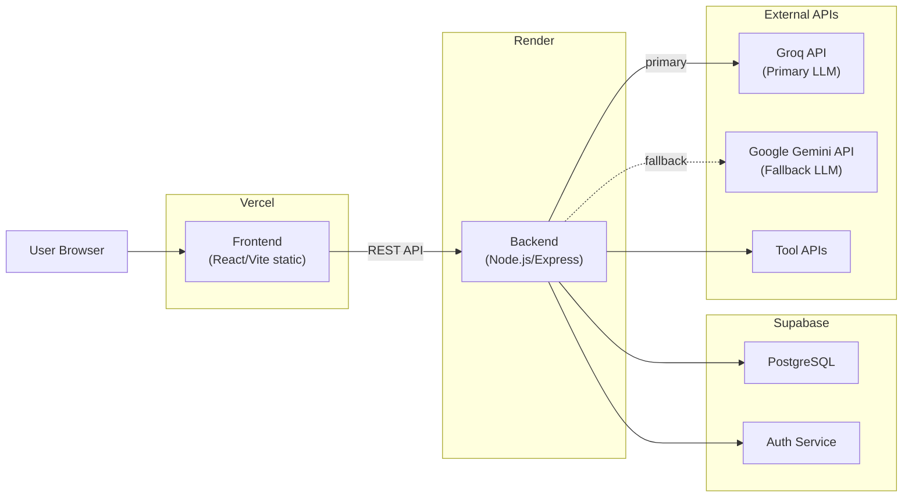

# Deployment — AURA

> **Status**: `PROPOSED` — Deployment strategy defined, specific services pending final team decision.

---

## 1. Deployment Goals

1. **Free or low-cost** — Stay within free tiers for all services
2. **Fast deployment** — Under 10 minutes from push to live
3. **Reliable for demo** — Must not crash or cold-start during judging
4. **Simple** — Minimal deployment infrastructure
5. **Rollback-capable** — Can revert to last working version quickly

---

## 2. Hosting Comparison

### Frontend Hosting

| Service | Free Tier | Deploy Speed | Cold Start | HTTPS | Status |
|---------|-----------|-------------|------------|-------|--------|
| **Vercel** | ✅ Unlimited static, 100GB BW | ★★★★★ | None (CDN) | ✅ Auto | `RECOMMENDED` |
| Netlify | ✅ 100GB BW, 300 build min | ★★★★☆ | None (CDN) | ✅ Auto | `ALTERNATIVE` |
| Cloudflare Pages | ✅ Unlimited BW | ★★★★☆ | None (CDN) | ✅ Auto | `ALTERNATIVE` |

**Decision**: `PROPOSED` — Vercel (fastest deploy, GitHub integration, zero config for Vite)

### Backend Hosting

| Service | Free Tier | Deploy Speed | Cold Start | HTTPS | Status |
|---------|-----------|-------------|------------|-------|--------|
| **Render** | ✅ 750 hrs/month, 512MB RAM | ★★★★☆ | ⚠️ 30-50s after inactivity | ✅ Auto | `RECOMMENDED` |
| Railway | ✅ $5 credit/month | ★★★★☆ | Minimal | ✅ Auto | `ALTERNATIVE` |
| Fly.io | ✅ 3 VMs, 256MB | ★★★☆☆ | Minimal | ✅ Auto | `ALTERNATIVE` |

**Decision**: `PROPOSED` — Render (simplest Node.js deploy, good free tier)

**Cold start mitigation**: 
- Ping the backend URL 5 minutes before demo
- Set up a cron health check (free tier allows this)

### Database

| Service | Free Tier | Status |
|---------|-----------|--------|
| **Supabase** | ✅ 500MB, 50k rows, auth included | `RECOMMENDED` |

### AI Model Providers

| Service | Free Tier / Limits | Role | Status |
|---------|--------------------|------|--------|
| **Groq API** | ✅ Generous developer limits, ultra-fast TPS (LPUs) | Primary LLM Provider | `RECOMMENDED` |
| **Google Gemini API** | ✅ 15 RPM (Flash), 2 RPM (Pro), large context | Secondary / Fallback Provider | `RECOMMENDED` |

---

## 3. Deployment Topology



---

## 4. Environment Variables

### Frontend (Vercel)

```env
# .env.example (frontend)
VITE_API_BASE_URL=https://aura-backend.onrender.com/api/v1
VITE_SUPABASE_URL=https://your-project.supabase.co
VITE_SUPABASE_ANON_KEY=your-anon-key-here
```

> **IMPORTANT**: Only `VITE_`-prefixed variables are exposed to the frontend. Never put secret keys here.

### Backend (Render)

```env
# .env.example (backend)
PORT=3001
NODE_ENV=production

# Supabase
SUPABASE_URL=https://your-project.supabase.co
SUPABASE_SERVICE_ROLE_KEY=
SUPABASE_JWT_SECRET=

# AI Provider Configuration
AI_PROVIDER=groq
AI_ENABLE_FALLBACK=true

# Primary AI Provider: Groq
GROQ_API_KEY=
GROQ_MODEL=

# Secondary / Fallback AI Provider: Google Gemini
GEMINI_API_KEY=
GEMINI_MODEL=

# External Tool APIs (add as needed)
OPENWEATHER_API_KEY=
GITHUB_TOKEN=

# CORS
ALLOWED_ORIGINS=https://aura-frontend.vercel.app

# Rate limiting
MAX_TASKS_PER_MINUTE=5
```

> **CRITICAL**: NEVER commit actual values. Only `.env.example` with empty values goes in Git.

---

## 5. Development Environment

### Prerequisites

| Tool | Version | Purpose |
|------|---------|---------|
| Node.js | ≥ 18.x | Runtime |
| npm | ≥ 9.x | Package manager |
| Git | Latest | Version control |

### Local Setup

```bash
# Clone repository
git clone <repo-url>
cd VIT-HackBattle-Project

# Frontend setup
cd frontend
cp .env.example .env    # Fill in local values
npm install
npm run dev             # → http://localhost:5173

# Backend setup (new terminal)
cd backend
cp .env.example .env    # Fill in local values
npm install
npm run dev             # → http://localhost:3001

# Agent module (if separate)
cd agent
cp .env.example .env
npm install
```

### Local Development URLs

| Service | URL |
|---------|-----|
| Frontend | `http://localhost:5173` |
| Backend API | `http://localhost:3001/api/v1` |
| Supabase Dashboard | `https://app.supabase.com/project/<id>` |

---

## 6. Build Commands

### Frontend

```bash
cd frontend
npm run build    # → produces dist/ directory
npm run preview  # → preview production build locally
```

### Backend

```bash
cd backend
npm start        # Production start
npm run dev      # Development with nodemon/watch
```

---

## 7. Deployment Workflow

### Frontend → Vercel

1. Push to `main` branch (or configured branch)
2. Vercel auto-detects Vite project
3. Runs `npm run build`
4. Deploys `dist/` to CDN
5. Available at `https://aura-frontend.vercel.app`

**Configuration**:
- Build command: `npm run build`
- Output directory: `dist`
- Root directory: `frontend`
- Environment variables: Set in Vercel dashboard

### Backend → Render

1. Push to `main` branch
2. Render auto-detects Node.js
3. Runs `npm install` → `npm start`
4. Available at `https://aura-backend.onrender.com`

**Configuration**:
- Build command: `npm install`
- Start command: `npm start`
- Root directory: `backend`
- Environment variables: Set in Render dashboard

### Database → Supabase

1. Create project in Supabase dashboard
2. Run SQL migration to create tables
3. Configure RLS policies
4. Copy connection details to backend `.env`

---

## 8. CORS Configuration

```javascript
// backend/src/config/cors.js
const corsOptions = {
  origin: process.env.ALLOWED_ORIGINS?.split(',') || ['http://localhost:5173'],
  methods: ['GET', 'POST', 'PUT', 'DELETE'],
  allowedHeaders: ['Content-Type', 'Authorization'],
  credentials: true
};
```

| Environment | Allowed Origins |
|-------------|----------------|
| Development | `http://localhost:5173` |
| Production | `https://aura-frontend.vercel.app` |

---

## 9. Health Check

```
GET /api/v1/health

Response:
{
  "success": true,
  "data": {
    "status": "healthy",
    "timestamp": "2026-09-12T10:00:00Z"
  }
}
```

Render can use this endpoint for health monitoring.

---

## 10. Post-Deployment Smoke Test

After every deployment:

- [ ] Production frontend URL loads (HTTP 200)
- [ ] Frontend renders correctly (no blank page)
- [ ] Health endpoint responds (`/api/v1/health`)
- [ ] Task creation works
- [ ] Task execution completes
- [ ] Database reads/writes work
- [ ] AI provider calls work (Groq primary, Gemini fallback verified)
- [ ] External tool APIs respond
- [ ] No CORS errors in browser console
- [ ] No 500 errors in server logs

---

## 11. Demo-Day Checklist

### 30 Minutes Before Demo

- [ ] Verify production URL is live
- [ ] Ping backend to warm up (avoid cold start)
- [ ] Run full demo flow once
- [ ] Verify all environment variables are set
- [ ] Verify external APIs are responding
- [ ] Have local fallback ready (`localhost` with mock data)
- [ ] Clear browser cache
- [ ] Open DevTools Network tab (in case of issues)

### During Demo

- [ ] Use pre-tested goal text (don't improvise)
- [ ] Have 2 backup goal texts ready
- [ ] Monitor for API errors
- [ ] If something fails, explain and show audit trail

---

## 12. Rollback Plan

| Scenario | Action |
|----------|--------|
| Frontend deployment breaks | Revert to previous Vercel deployment (instant) |
| Backend deployment breaks | Revert to previous Render deployment |
| Database migration breaks | Restore from Supabase backup |
| External API is down | Switch to cached/mock responses |
| Everything breaks | Run local demo with mock data as fallback |

### Emergency Local Fallback

```bash
# If production is down, run locally for demo
cd frontend && npm run build && npm run preview
cd backend && npm start
# Point frontend to localhost backend
```

---

## 13. Logging & Monitoring

### Backend Logging

- Use `console.log` / `console.error` (Render captures stdout/stderr)
- Log all API requests (method, path, status code, duration)
- Log all errors with stack traces
- Log all tool execution results (success/failure)
- Do NOT log secrets or full request bodies with sensitive data

### Monitoring

| Tool | Purpose | Free? |
|------|---------|-------|
| Render dashboard | Backend logs, deploy status | ✅ |
| Vercel dashboard | Frontend deploy status | ✅ |
| Supabase dashboard | Database status, query logs | ✅ |
| Browser DevTools | Frontend errors, network | ✅ |

---

## 14. Production URLs

| Service | URL | Status |
|---------|-----|--------|
| Frontend | `TBD` | Not yet deployed |
| Backend | `TBD` | Not yet deployed |
| Database | Supabase project URL | `TBD` |
| Health Check | `TBD/api/v1/health` | Not yet deployed |