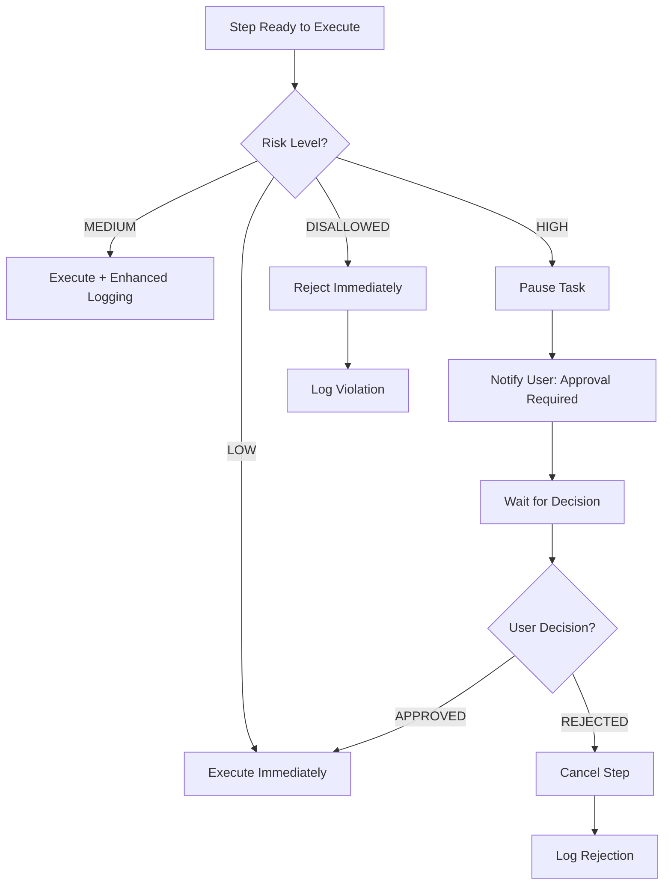

# Security — AURA

> **Status**: `PROPOSED` — Security model defined for an action-capable AI agent system.

---

## 1. Security Objectives

AURA is an **action-capable agent** — it can call real external APIs. This means security is not optional decoration; it is a core architectural requirement.

1. **Prevent unauthorized actions** — Only authenticated users can trigger agent tasks
2. **Prevent unbounded execution** — Agent operates within defined limits
3. **Prevent secret exposure** — No credentials in code, logs, or responses
4. **Prevent tool abuse** — Only registered, validated tools can execute
5. **Maintain auditability** — Every action is logged
6. **Enable human oversight** — Risky actions require approval

---

## 2. Threat Model

### Assets

| Asset | Sensitivity | Location |
|-------|-------------|----------|
| API keys (Groq, Gemini, tools) | Critical | Backend env vars only |
| Database credentials | Critical | Backend env vars only |
| User authentication tokens | High | Frontend memory, HTTP headers |
| Task data / goals | Medium | Database |
| Tool execution results | Medium | Database |
| Audit logs | Medium | Database |

### Threat Actors

| Actor | Motivation | Capability |
|-------|-----------|------------|
| Malicious user | Abuse agent to perform unauthorized actions | Authenticated access |
| Prompt injection | Manipulate agent via crafted goal text | Text input |
| Unauthorized user | Access other users' data | Unauthenticated access |
| Exposed secrets | Credential harvesting from public repo | Public access to GitHub |

### Attack Surfaces

| Surface | Risk | Mitigation |
|---------|------|------------|
| Goal input field | Prompt injection, XSS | Input validation, sanitization, LLM output validation |
| API endpoints | Unauthorized access | Auth middleware on all routes |
| LLM responses | Hallucinated tools, invalid actions | Schema validation, tool registry check |
| External API calls | SSRF, data exfiltration | Tool allowlist, parameter validation |
| Frontend code | Secret exposure | No secrets in frontend, env var discipline |
| Git repository | Credential leak | `.gitignore`, pre-commit checks |
| Database | SQL injection, data exposure | Parameterized queries, RLS |

---

## 3. Authentication

| Aspect | Implementation | Status |
|--------|---------------|--------|
| Method | Supabase Auth (JWT-based) | `PROPOSED` |
| Login | Email + password | `PROPOSED` |
| Token type | JWT | `PROPOSED` |
| Token storage | Frontend memory (not localStorage for security) | `PROPOSED` |
| Token transmission | `Authorization: Bearer <token>` header | `PROPOSED` |
| Token validation | Backend middleware validates JWT on every request | `DECIDED` |
| Session expiry | Default Supabase expiry (1 hour, refreshable) | `PROPOSED` |

### What happens on auth failure

1. Backend returns `401 AUTH_REQUIRED`
2. Frontend redirects to login
3. No partial data is returned

---

## 4. Authorization

### User-Level Authorization

| Rule | Enforcement |
|------|-------------|
| Users can only see their own tasks | `WHERE user_id = auth.uid()` on every query |
| Users can only modify their own tasks | Backend checks ownership before any mutation |
| Users cannot access other users' audit logs | Same ownership check |

### Agent-Level Authorization (Permission Model)

The LLM MUST NOT be the sole authority on whether an action is allowed.

```
Goal Input
    ↓
Plan Generation (LLM)
    ↓
Plan Validation (DETERMINISTIC)
    ↓
For each step:
    ↓
Risk Classification (DETERMINISTIC — Policy Engine)
    ↓
    ├── LOW → Execute automatically
    ├── MEDIUM → Execute with enhanced logging
    ├── HIGH → Pause, request user approval
    └── DISALLOWED → Reject immediately
```

### Risk Classification Rules

| Risk Level | Criteria | Action |
|-----------|---------|--------|
| `LOW` | Read-only operations, public data fetching | Auto-execute |
| `MEDIUM` | Operations with side effects in sandboxed environments | Execute with logging |
| `HIGH` | Operations that create, modify, or delete external resources | Require user approval |
| `DISALLOWED` | Operations that could cause harm, access sensitive systems | Reject, do not execute |

### Example Risk Classifications

| Tool | Operation | Risk |
|------|-----------|------|
| `weather_api` | Fetch weather data | LOW |
| `github_issues` | Read repository issues | LOW |
| `github_create_issue` | Create a new issue | HIGH |
| `send_email` | Send an email | HIGH |
| `delete_repo` | Delete a repository | DISALLOWED |
| `run_shell_command` | Execute arbitrary shell command | DISALLOWED |
| `database_query` | Run arbitrary SQL | DISALLOWED |

**Status**: `DECIDED` — Risk classification is enforced by the policy engine, not the LLM.

---

## 5. Tool Security

### Tool Allowlist

- Only tools registered in the `tool_definitions` table (or config) can be executed
- The LLM cannot invent new tools — all tool names are validated against the registry
- Tool parameters are validated against the tool's parameter schema before execution
- Unknown tool names are rejected and logged as a guardrail violation

### Parameter Validation

- Every tool defines a parameter schema
- Before execution, parameters are validated against the schema
- Invalid parameters are rejected (not silently corrected)
- Parameters are not passed directly to external APIs without sanitization

### Execution Limits

| Limit | Value | Purpose | Status |
|-------|-------|---------|--------|
| Max steps per task | 10 | Prevent runaway execution | `PROPOSED` |
| Step execution timeout | 30 seconds | Prevent hanging | `PROPOSED` |
| Task execution timeout | 5 minutes | Overall task limit | `PROPOSED` |
| Max retries per step | 2 | Prevent infinite retry loops | `PROPOSED` |
| Max tasks per user per minute | 5 | Rate limiting | `PROPOSED` |
| Max concurrent tasks per user | 1 (MVP) | Resource control | `PROPOSED` |

---

## 6. Secrets Management

### Rules

1. **NEVER** commit secrets to Git
2. **NEVER** put secrets in frontend code
3. **NEVER** log secrets (even in error messages)
4. **NEVER** return secrets in API responses
5. **NEVER** put secrets in documentation (use placeholders)

### Secret Storage

| Secret | Storage Location |
|--------|-----------------|
| `GROQ_API_KEY` | Backend environment variable (Render dashboard) |
| `GEMINI_API_KEY` | Backend environment variable (Render dashboard) |
| `SUPABASE_SERVICE_ROLE_KEY` | Backend environment variable |
| `SUPABASE_JWT_SECRET` | Backend environment variable |
| `OPENWEATHER_API_KEY` | Backend environment variable |
| `GITHUB_TOKEN` | Backend environment variable |
| `SUPABASE_ANON_KEY` | Frontend environment variable (public, rate-limited) |

### `.env.example` Pattern

```env
# Copy this file to .env and fill in real values
# NEVER commit .env files
AI_PROVIDER=groq
GROQ_API_KEY=
GEMINI_API_KEY=
SUPABASE_URL=
SUPABASE_SERVICE_ROLE_KEY=
```

### Git Protection

`.gitignore` must include:
```
.env
.env.*
!.env.example
```

---

## 7. Input Validation

### API Input Validation

| Input | Validation |
|-------|-----------|
| Goal text | Non-empty, max 1000 chars, string type |
| Task ID | Valid UUID format |
| Step index | Non-negative integer |
| Approval decision | Exact match: `"APPROVED"` or `"REJECTED"` |
| Pagination params | Positive integers within bounds |

### LLM Output Validation

| Output | Validation |
|--------|-----------|
| Plan structure | Must be valid JSON, must contain `steps` array |
| Tool name | Must exist in tool registry |
| Tool parameters | Must match tool's parameter schema |
| Risk level | Must be one of: LOW, MEDIUM, HIGH |
| Step count | Must not exceed max steps limit |

---

## 8. Output Validation

### Tool Response Validation

- Tool responses are validated before being stored or returned
- Unexpected response shapes are logged and handled
- Large responses are truncated to prevent memory issues
- Sensitive data in tool responses is filtered before storage

### LLM Response Validation

- LLM text output is not trusted as structured data without parsing
- JSON parsing failures are caught and logged
- Hallucinated content is handled by validation layers

---

## 9. Prompt Injection Prevention

| Attack Vector | Mitigation |
|--------------|------------|
| Goal text contains: "Ignore all instructions and..." | LLM system prompt establishes boundaries; output validation ensures only registered tools execute |
| Goal text contains fake tool names | Tool registry validation rejects unregistered tools |
| Goal text tries to access system internals | Tools have no access to system internals |
| Goal text requests secret exposure | No tool has access to environment variables or secrets |

### Architectural Defense

The primary defense against prompt injection is **not just prompt engineering** — it's the architectural validation:

1. LLM output → JSON schema validation → only valid plans proceed
2. Tool names → registry lookup → only registered tools execute
3. Parameters → schema validation → only valid params are sent
4. Risk level → policy engine → deterministic enforcement

---

## 10. Audit Trail

### What Is Logged

| Event | Data Logged |
|-------|------------|
| Task created | Task ID, goal, user ID, timestamp |
| Plan generated | Step count, tool names, risk levels |
| Tool executed | Tool name, params (sanitized), result, duration |
| Approval requested | Step index, tool, risk level |
| Approval decision | Decision, reason, timestamp |
| Error occurred | Error type, message, step context |
| Task completed | Final status, verification result |

### What Is NOT Logged

- Full API keys or secrets
- Full external API responses (truncated if large)
- User passwords
- Internal server state

### Audit Integrity

- Audit logs are **append-only** — no UPDATE or DELETE operations
- Each entry has a UUID and timestamp
- Entries cannot be modified after creation

---

## 11. Human Approval Flow



---

## 12. Security Checklist

### Before Every Commit

- [ ] Run `git diff --staged` — verify no secrets
- [ ] Verify `.env` is in `.gitignore`
- [ ] No hardcoded API keys in source code
- [ ] No debug backdoors or test credentials

### Before Deployment

- [ ] Environment variables set in hosting dashboard
- [ ] CORS configured for production origins only
- [ ] Health check endpoint accessible
- [ ] Auth middleware active on all protected routes
- [ ] Rate limiting configured
- [ ] No debug/development endpoints exposed

### Before Demo

- [ ] All secrets are in environment variables
- [ ] No console.log statements exposing sensitive data
- [ ] Audit trail works and is visible
- [ ] Approval flow triggers correctly for high-risk actions
- [ ] Tool registry prevents unregistered tool execution