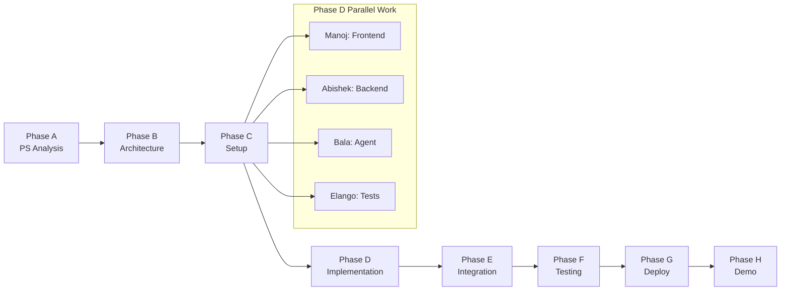

# Team Workflow — AURA

> **Status**: `DECIDED` — Team roles confirmed after problem statement analysis.

---

## 1. Team

| # | Member | Role | Primary Responsibility | Status |
|---|--------|------|----------------------|--------|
| 1 | **Kamal** | Tech Lead | Architecture, coordination, integration, final QA | `DECIDED` |
| 2 | **Manoj** | Frontend | Frontend + UI/UX (React/Vite) | `DECIDED` |
| 3 | **Abishek** | Backend | Backend API + Database (Express, Supabase) | `DECIDED` |
| 4 | **Bala Subramanian V** | AI Engineer | AI/Agent layer + Backend support | `DECIDED` |
| 5 | **Elango** | QA/DevOps | Testing, deployment, integration support | `DECIDED` |

---

## 2. Ownership Matrix

| Component | Owner | Support | Documentation |
|-----------|-------|---------|---------------|
| `frontend/` | Manoj | Kamal | 04-DESIGN-SYSTEM, 03-API-CONTRACT |
| `backend/` | Abishek | Bala | 02-ARCHITECTURE, 03-API-CONTRACT, 05-DATABASE |
| `agent/` | Bala | Abishek | 02-ARCHITECTURE, 08-SECURITY |
| Database schema | Abishek | Bala | 05-DATABASE |
| API contract | Abishek | Kamal | 03-API-CONTRACT |
| Tool registry | Bala | Abishek | 02-ARCHITECTURE, 08-SECURITY |
| Policy engine | Bala | Abishek | 08-SECURITY |
| Testing | Elango | All | 06-TESTING |
| Deployment | Elango | Kamal | 07-DEPLOYMENT |
| Integration | Kamal | Elango | 11-INTEGRATION-CONTRACT |
| Documentation | Kamal | All | All docs |

---

## 3. Branch Strategy

```
main (deployable)
│
├── feature/frontend        (Manoj)
├── feature/backend         (Abishek)
├── feature/agent           (Bala)
├── feature/testing         (Elango)
└── feature/integration     (Kamal)
```

### Rules

1. `main` must remain deployable at all times
2. Each member works on their feature branch
3. Pull from `main` before starting work each session
4. Merge to `main` only after testing passes
5. Merge conflicts are resolved by the person merging
6. If a conflict involves another member's code, coordinate first
7. No force-pushing to `main`
8. No force-pushing to shared branches without team agreement

---

## 4. Commit Conventions

```
feat: add task creation endpoint
fix: resolve CORS configuration error
refactor: simplify plan validation logic
test: add API integration tests
docs: update API contract with approval endpoint
style: fix dashboard layout spacing
chore: update dependencies
```

### Rules

1. Every commit message starts with a type prefix
2. Keep messages concise and descriptive
3. Reference the component: `feat(backend): add task CRUD`
4. Do not commit generated files, `node_modules/`, or `.env`
5. Do not commit debug code or `console.log` spam

---

## 5. Integration Process

```
Member completes feature
        ↓
Local testing passes
        ↓
git add . && git commit
        ↓
git push origin feature/<branch>
        ↓
Notify team (or create PR)
        ↓
Kamal / Elango reviews
        ↓
Merge to main
        ↓
Integration testing on main
        ↓
Deploy
```

### Review Criteria

- [ ] Code follows the documented API contract
- [ ] No secrets committed
- [ ] No unnecessary dependencies added
- [ ] Tests pass
- [ ] Error handling is present
- [ ] Documentation is updated if behavior changed

---

## 6. Hackathon Schedule

### Phase A: Problem Statement Analysis (Hour 0-1)

| Task | Owner | Duration |
|------|-------|----------|
| Analyze PS | All | 30 min |
| Define product direction | Kamal | 30 min |
| Document decisions | Kamal | included |

### Phase B: Architecture & Contracts (Hour 1-3)

| Task | Owner | Duration |
|------|-------|----------|
| Finalize architecture | Kamal | 1 hr |
| Define API contract | Kamal + Abishek | 1 hr |
| Define database schema | Abishek + Bala | 30 min |
| Define design system | Manoj | 30 min |
| Set up project structure | All | 30 min |

### Phase C: Development Environment (Hour 3-4)

| Task | Owner | Duration |
|------|-------|----------|
| Initialize frontend project | Manoj | 30 min |
| Initialize backend project | Abishek | 30 min |
| Set up Supabase project | Abishek | 30 min |
| Set up Groq & Gemini API access | Bala | 30 min |
| Set up deployment infrastructure | Elango | 30 min |

### Phase D: Parallel Implementation (Hour 4-24)

> This is the main development phase. All members work independently using contracts.

| Member | Tasks | Dependencies |
|--------|-------|-------------|
| **Manoj** | Dashboard, Goal Input, Task Display, Plan Viewer, Approval UI, Audit Log, Status states | API contract (03), Design system (04) |
| **Abishek** | Express server, Auth middleware, Task CRUD, Validation, Database queries, Policy engine | API contract (03), Database schema (05) |
| **Bala** | Agent orchestrator, Planner (LLM), Tool registry, Tool router, Tool implementations | Architecture (02), Security (08) |
| **Elango** | Test framework setup, API tests, Integration tests, Deployment pipeline | Testing (06), Deployment (07) |
| **Kamal** | Coordination, unblock dependencies, review PRs, documentation sync | All docs |

### Phase E: Integration (Hour 24-28)

| Task | Owner | Duration |
|------|-------|----------|
| Frontend ↔ Backend integration | Manoj + Abishek | 2 hr |
| Backend ↔ Agent integration | Abishek + Bala | 2 hr |
| End-to-end testing | Elango | 2 hr |
| Bug fixes | All | included |

### Phase F: Testing & Polish (Hour 28-32)

| Task | Owner | Duration |
|------|-------|----------|
| Full integration testing | Elango | 2 hr |
| Security verification | Elango + Abishek | 1 hr |
| UI polish | Manoj | 2 hr |
| Bug fixes | All | included |
| Performance check | Kamal | 1 hr |

### Phase G: Deployment (Hour 32-34)

| Task | Owner | Duration |
|------|-------|----------|
| Production deployment | Elango | 1 hr |
| Production verification | Elango + Kamal | 30 min |
| Smoke testing | All | 30 min |

### Phase H: Demo Hardening (Hour 34-36)

| Task | Owner | Duration |
|------|-------|----------|
| Demo script preparation | Kamal | 30 min |
| Demo rehearsal (3 runs) | All | 1 hr |
| Fix any demo issues | All | 30 min |
| Final README update | Kamal | 15 min |

---

## 7. Dependencies



### Critical Dependencies

| Dependency | Blocker For | Resolution |
|-----------|------------|------------|
| API contract must be frozen | Frontend, Backend, Testing | Freeze in Phase B |
| Database schema must be defined | Backend | Define in Phase B |
| Tool registry must be defined | Agent, Frontend (tool display) | Define in Phase B/C |
| Supabase project must be created | Backend, Auth | Create in Phase C |
| Groq & Gemini API access must work | Agent | Verify in Phase C |

---

## 8. Communication

### During Hackathon

| Method | When |
|--------|------|
| In-person | Always preferred |
| Group chat | Quick updates, non-blocking questions |
| Git commit messages | Record of changes |
| Documentation | Source of truth |

### When to Notify Others

1. API contract change needed → Notify Kamal + affected members
2. Database schema change → Notify Abishek + Bala
3. Blocker found → Notify Kamal immediately
4. Feature completed → Notify Elango (for testing)
5. Deployment issue → Notify Elango + Kamal

---

## 9. Conflict Resolution

| Conflict | Resolution |
|----------|------------|
| Technical disagreement | Kamal makes final call (architecture owner) |
| API contract disagreement | Refer to `docs/03-API-CONTRACT.md`, update if needed |
| Merge conflict in `main` | Person merging resolves; consult affected code owner |
| Scope disagreement | Refer to MVP criteria in `docs/01-PROJECT-OVERVIEW.md` |
| Time pressure | Cut P2 features first, then P1, preserve P0 |

---

## 10. Definition of Done (Per Member)

### Manoj (Frontend)

- [ ] All P0 screens implemented
- [ ] All task states render correctly
- [ ] API integration works with real backend
- [ ] Loading/error/empty states work
- [ ] Responsive on desktop
- [ ] No console errors

### Abishek (Backend)

- [ ] All documented endpoints work
- [ ] Input validation on all endpoints
- [ ] Auth middleware protects routes
- [ ] Database CRUD operations work
- [ ] Error responses match documented format
- [ ] Audit logs are created

### Bala (Agent)

- [ ] Plan generation works with real LLM
- [ ] Tool execution works with real APIs
- [ ] Policy engine classifies risk correctly
- [ ] Approval flow pauses execution
- [ ] Error handling prevents crashes
- [ ] Verification produces evidence

### Elango (Testing/Deployment)

- [ ] API tests pass
- [ ] Integration tests pass
- [ ] Demo smoke test passes 3 times
- [ ] Production deployment works
- [ ] Health check passes
- [ ] No critical bugs open

### Kamal (Integration)

- [ ] All components integrated on `main`
- [ ] End-to-end flow works
- [ ] Documentation is current
- [ ] Demo script tested
- [ ] No secrets committed
- [ ] README updated

---

## 11. Emergency Procedures

| Emergency | Action |
|-----------|--------|
| **Main branch broken** | Revert to last known good commit |
| **External API down** | Switch to mock/cached responses |
| **Database corruption** | Restore from Supabase backup |
| **Team member unavailable** | Kamal redistributes critical tasks |
| **Feature won't work in time** | Cut feature, mark as P2, focus on working MVP |
| **Deployment fails** | Use local demo fallback |
| **Demo crashes** | Show audit trail, explain architecture, run backup demo |