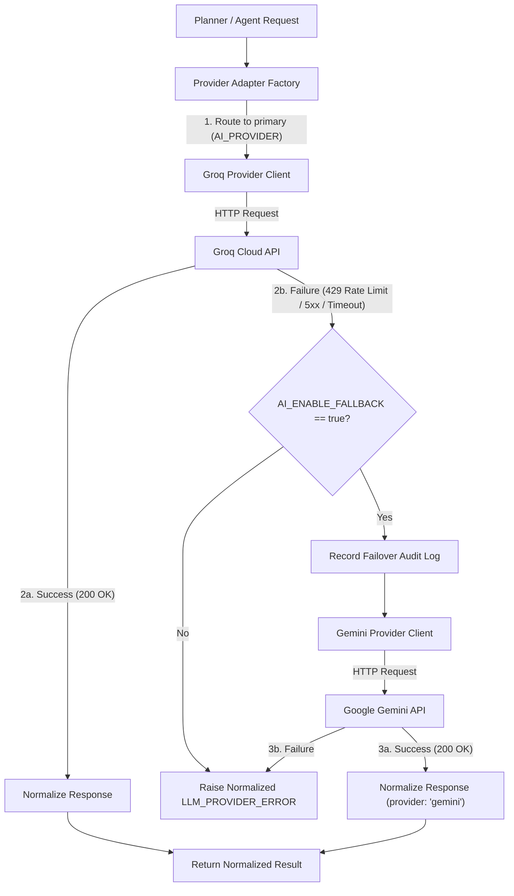

# Integration Contract — AURA

> **Status**: `PROPOSED` — This document defines the exact boundaries between all modules. Every team member MUST follow this contract.

---

## 1. Integration Principles

1. **Contract-first**: All interfaces documented before implementation
2. **Single source of truth**: This document + API contract define all boundaries
3. **No invention**: Frontend must not invent backend responses. Backend must not invent AI interfaces. AI must not bypass backend security.
4. **Schema consistency**: Identical field names, types, and structures across all layers
5. **Independent development**: Each module can be built and tested in isolation using the documented contracts

---

## 2. Source of Truth

| Boundary | Source Document |
|----------|----------------|
| Frontend ↔ Backend | `docs/03-API-CONTRACT.md` |
| Backend ↔ Database | `docs/05-DATABASE.md` |
| Backend ↔ AI/Agent | This document (Section 7) |
| AI/Agent ↔ LLM Providers | This document (Section 8) |
| AI/Agent ↔ Tools | This document (Section 9) |
| All boundaries | This document |
| Task states | `docs/03-API-CONTRACT.md` Section 5 |
| Error format | `docs/03-API-CONTRACT.md` Section 4 |

---

## 3. Module Boundaries

### 3.1 Frontend → Backend

| Aspect | Rule |
|--------|------|
| **Communication** | HTTP REST API only |
| **Base URL** | `VITE_API_BASE_URL` environment variable |
| **Authentication** | JWT in `Authorization: Bearer <token>` header |
| **Request format** | JSON body matching documented schema |
| **Response format** | JSON body matching documented schema |
| **Error handling** | Frontend must handle all documented error codes |
| **Real-time updates** | Polling `GET /tasks/:id` every 2-3 seconds (TBD: may switch to SSE) |

**RULE**: Frontend MUST NEVER invent backend API responses. If the backend returns a field not documented in the API contract, frontend should ignore it. If frontend needs a field that doesn't exist, request an API contract update.

### 3.2 Backend → Database

| Aspect | Rule |
|--------|------|
| **Communication** | Supabase JS client (server-side only) |
| **Access** | Service role key (never exposed to frontend) |
| **Schema** | Must match `docs/05-DATABASE.md` |
| **Queries** | Parameterized — never concatenate user input |
| **User isolation** | Every query includes `user_id` filter |

**RULE**: Backend MUST NOT expose database internals to the frontend. All database operations are abstracted behind API endpoints.

### 3.3 Backend → AI/Agent Layer

| Aspect | Rule |
|--------|------|
| **Communication** | Direct function calls (same process or imported module) |
| **Interface** | Documented in Section 7 of this document |
| **Input** | Task goal, user context, available tools |
| **Output** | Structured execution result |
| **Error handling** | Agent returns structured errors; backend translates to API responses |

**RULE**: The AI layer MUST NOT directly access the database, make HTTP responses, or bypass backend security controls.

### 3.4 AI/Agent → Tools

| Aspect | Rule |
|--------|------|
| **Communication** | Through the tool router only |
| **Tool selection** | Only tools in the tool registry |
| **Validation** | Parameters validated before execution |
| **Execution** | HTTP calls to external APIs with timeout |
| **Results** | Structured `{ success, data, error }` format |

**RULE**: Tools MUST be registered and permission-checked. The LLM cannot invent tools.

### 3.5 AI/Agent → LLM Providers (Provider-Agnostic Adapter)

| Aspect | Rule |
|--------|------|
| **Communication** | Unified `ILLMProvider` interface |
| **Primary Provider** | Groq API (ultra-fast inference, LPU hardware) |
| **Fallback Provider** | Google Gemini API (high availability, large context) |
| **Selection** | Configuration-driven (`AI_PROVIDER=groq|gemini`, default: `groq`) |
| **Failover** | Automatic fallback to Gemini if Groq returns 429/5xx (when `AI_ENABLE_FALLBACK=true`) |
| **Normalization** | Adapter normalizes system prompts, tool schemas, and JSON outputs |
| **Decoupling** | Agent reasoning logic (Planner, Orchestrator, Verifier) must NEVER import vendor-specific SDKs directly |

**RULE**: The Agent/Planner MUST NOT depend directly on vendor-specific code or proprietary API structures. All LLM calls pass through the provider adapter.

### 3.6 Authentication Boundary

| Aspect | Rule |
|--------|------|
| **Token issuer** | Supabase Auth |
| **Token validation** | Backend middleware (every request) |
| **Frontend responsibility** | Store token, send in headers, redirect on 401 |
| **Backend responsibility** | Validate token, extract user_id, reject invalid tokens |

---

## 4. Task State Contract

All layers MUST use these exact state values (case-sensitive strings):

```javascript
const TASK_STATES = {
  QUEUED: 'QUEUED',
  PLANNING: 'PLANNING',
  AWAITING_APPROVAL: 'AWAITING_APPROVAL',
  EXECUTING: 'EXECUTING',
  OBSERVING: 'OBSERVING',
  REPLANNING: 'REPLANNING',
  VERIFYING: 'VERIFYING',
  COMPLETED: 'COMPLETED',
  PARTIALLY_COMPLETED: 'PARTIALLY_COMPLETED',
  FAILED: 'FAILED',
  CANCELLED: 'CANCELLED'
};
```

**Canonical location**: `shared/taskStates.js`

All layers import from this file. No layer defines its own state constants.

---

## 5. Step Status Contract

```javascript
const STEP_STATUSES = {
  PENDING: 'PENDING',
  EXECUTING: 'EXECUTING',
  COMPLETED: 'COMPLETED',
  FAILED: 'FAILED',
  SKIPPED: 'SKIPPED',
  AWAITING_APPROVAL: 'AWAITING_APPROVAL',
  APPROVED: 'APPROVED',
  REJECTED: 'REJECTED'
};
```

---

## 6. Error Contract

All layers use this error format:

```javascript
{
  success: false,
  error: {
    code: "ERROR_CODE",     // Uppercase snake_case
    message: "Human-readable description"
  }
}
```

Backend translates internal errors to this format before sending to frontend.

---

## 7. Backend ↔ AI/Agent Interface

### 7.1 Execute Task

**Caller**: Backend (Task Manager)
**Callee**: Agent Orchestrator

```javascript
// Interface
async function executeTask(input) {
  // input: ExecuteTaskInput
  // returns: ExecuteTaskResult
}

// ExecuteTaskInput
{
  taskId: "uuid",          // Task ID from database
  goal: "string",         // User's goal text
  userId: "uuid",         // Authenticated user ID
  availableTools: [...],  // Array of tool definitions from registry
  memory: [...],          // Relevant memory entries (P1)
  maxSteps: 10,           // Maximum allowed steps
  timeout: 300000         // Timeout in milliseconds (5 min)
}

// ExecuteTaskResult
{
  status: "COMPLETED" | "PARTIALLY_COMPLETED" | "FAILED",
  plan: {
    steps: [
      {
        stepIndex: 0,
        description: "Fetch weather data",
        tool: "weather_api",
        params: { city: "Chennai" },
        riskLevel: "LOW",
        status: "COMPLETED",
        result: { temperature: 32, condition: "Sunny" },
        error: null,
        startedAt: "ISO-timestamp",
        completedAt: "ISO-timestamp"
      }
    ]
  },
  result: {
    summary: "Human-readable summary of outcome",
    evidence: { ... },  // Data supporting the result
    verified: true
  },
  auditEntries: [
    { action: "PLAN_GENERATED", details: {...}, timestamp: "ISO" },
    { action: "TOOL_EXECUTED", details: {...}, timestamp: "ISO" }
  ],
  error: null  // Or { code: "...", message: "..." } if failed
}
```

### 7.2 Approval Callback

When the agent needs user approval:

```javascript
// Agent calls this callback provided by backend
async function requestApproval(approvalRequest) {
  // approvalRequest
  {
    taskId: "uuid",
    stepIndex: 2,
    tool: "github_create_issue",
    params: { title: "...", body: "..." },
    riskLevel: "HIGH",
    reason: "Creates a permanent public resource"
  }
  
  // Returns
  {
    decision: "APPROVED" | "REJECTED",
    reason: "optional reason"
  }
}
```

**Implementation note**: Backend updates task status to `AWAITING_APPROVAL`, writes approval request to database, and waits for user to submit decision via `POST /tasks/:id/approve`. Agent execution is paused until the decision is received.

---

---

## 8. AI/Agent ↔ LLM Provider Adapter Interface

### 8.1 Provider Contract (`BaseLLMProvider`)

All LLM provider implementations (`GroqProvider`, `GeminiProvider`) must conform to the unified provider contract:

```javascript
/**
 * Unified LLM Provider Interface
 */
class BaseLLMProvider {
  /**
   * Provider identifier ('groq' | 'gemini')
   */
  name;

  /**
   * Active model identifier (configured via env)
   */
  model;

  /**
   * Generate a structured execution plan from a goal
   * @param {Object} planRequest
   * @param {string} planRequest.goal - User goal
   * @param {Array} planRequest.tools - Normalized tool definitions
   * @param {Array} planRequest.memory - Relevant memory items
   * @param {Object} planRequest.constraints - Execution constraints (maxSteps, etc.)
   * @returns {Promise<NormalizedPlanResult>}
   */
  async generatePlan(planRequest) {}

  /**
   * Standard chat completion with optional tool calls and structured JSON output
   * @param {Object} chatRequest
   * @param {Array<{role: string, content: string}>} chatRequest.messages
   * @param {Array} [chatRequest.tools] - Normalized tool definitions
   * @param {Object} [chatRequest.responseFormat] - e.g., { type: 'json_object' }
   * @param {number} [chatRequest.temperature] - Sampling temperature
   * @returns {Promise<NormalizedChatResponse>}
   */
  async chatCompletion(chatRequest) {}
}
```

### 8.2 Normalized Plan Response

The adapter normalizes provider-specific responses into the standard AURA plan structure:

```javascript
// Normalized Plan Result returned to Orchestrator / Planner
{
  success: true,
  provider: "groq",                   // Provider that fulfilled the request ('groq' | 'gemini')
  model: "model-id-string",           // Exact model ID used
  plan: {
    steps: [
      {
        stepIndex: 0,
        tool: "weather_api",          // Must match a registered tool name
        parameters: { city: "Vellore" },
        reason: "Fetch current weather data to fulfill user goal",
        expectedOutcome: "Temperature and condition string"
      }
    ],
    estimatedRisk: "LOW"              // "LOW" | "MEDIUM" | "HIGH"
  },
  usage: {
    promptTokens: 128,
    completionTokens: 85,
    totalTokens: 213
  },
  latencyMs: 340,
  rawError: null
}
```

### 8.3 Failover & Provider Switching Semantics



#### Provider Error Classification
- `RATE_LIMIT_EXCEEDED`: HTTP 429 → Triggers fallback if enabled
- `PROVIDER_UNAVAILABLE`: HTTP 500/502/503/504 → Triggers fallback if enabled
- `TIMEOUT`: Request exceeded timeout threshold (e.g., 10s) → Triggers fallback if enabled
- `INVALID_OUTPUT`: Provider returned unparseable JSON → Retries up to 2 times before triggering fallback or failing

#### Failover Audit Entry Format
When failover occurs, an audit entry is deterministically created:
```javascript
{
  taskId: "uuid",
  action: "LLM_PROVIDER_FAILOVER",
  details: {
    primaryProvider: "groq",
    fallbackProvider: "gemini",
    reason: "Rate limit encountered (HTTP 429)",
    attemptedModel: "groq-model-id",
    fallbackModel: "gemini-model-id"
  },
  timestamp: "2026-09-12T14:40:00.000Z"
}
```

---

## 9. AI/Agent ↔ Tool Interface

### Tool Definition Schema

```javascript
{
  name: "weather_api",                    // Unique identifier
  description: "Fetch current weather",   // For LLM context
  parameters: {
    city: {
      type: "string",
      required: true,
      description: "City name"
    }
  },
  riskLevel: "LOW",                       // Default risk classification
  endpoint: "https://api.openweathermap.org/data/2.5/weather",  // Actual API URL
  method: "GET"                           // HTTP method
}
```

### Tool Execution Interface

```javascript
// Tool Router
async function executeTool(toolName, params) {
  // 1. Validate tool exists in registry
  // 2. Validate params against tool schema
  // 3. Execute HTTP call
  // 4. Return structured result

  // Returns:
  {
    success: true | false,
    data: { ... },         // Parsed response data
    error: null | {
      code: "TOOL_ERROR",
      message: "API returned 404"
    },
    durationMs: 1200,
    rawStatus: 200
  }
}
```

---

## 10. Environment Variables

### Shared Between Modules

| Variable | Used By | Description |
|----------|---------|-------------|
| `SUPABASE_URL` | Backend | Supabase project URL |
| `SUPABASE_SERVICE_ROLE_KEY` | Backend | Server-side DB access |
| `AI_PROVIDER` | Backend / Agent | Active AI provider (`groq` or `gemini`, default: `groq`) |
| `AI_ENABLE_FALLBACK` | Backend / Agent | Enable automatic fallback on rate limit/failure (`true` or `false`) |
| `GROQ_API_KEY` | Agent (via Backend) | Groq Cloud API key (Primary provider) |
| `GROQ_MODEL` | Agent (via Backend) | Groq model identifier (configurable, production model TBD) |
| `GEMINI_API_KEY` | Agent (via Backend) | Google Gemini API key (Fallback provider) |
| `GEMINI_MODEL` | Agent (via Backend) | Gemini model identifier (configurable, production model TBD) |

### Frontend Only

| Variable | Description |
|----------|-------------|
| `VITE_API_BASE_URL` | Backend API base URL |
| `VITE_SUPABASE_URL` | Supabase project URL (for auth client) |
| `VITE_SUPABASE_ANON_KEY` | Public Supabase key (rate-limited) |

### Backend Only

| Variable | Description |
|----------|-------------|
| `PORT` | Server port (default 3001) |
| `NODE_ENV` | Environment (development/production) |
| `ALLOWED_ORIGINS` | CORS allowed origins |
| `SUPABASE_JWT_SECRET` | JWT validation secret |

### Tool-Specific

| Variable | Description |
|----------|-------------|
| `OPENWEATHER_API_KEY` | Weather API access |
| `GITHUB_TOKEN` | GitHub API access |

---

## 11. Local Development

### Running All Modules Locally

```bash
# Terminal 1: Frontend
cd frontend
npm run dev
# → http://localhost:5173

# Terminal 2: Backend + Agent
cd backend
npm run dev
# → http://localhost:3001
```

### Frontend Pointing to Local Backend

```env
# frontend/.env
VITE_API_BASE_URL=http://localhost:3001/api/v1
```

### Frontend Using Mocks (Before Backend Ready)

```env
# frontend/.env
VITE_USE_MOCKS=true
```

---

## 12. Production Configuration

| Service | URL Pattern | Configuration |
|---------|------------|---------------|
| Frontend | `https://aura-*.vercel.app` | Vercel dashboard |
| Backend | `https://aura-*.onrender.com` | Render dashboard |
| Database | `https://*.supabase.co` | Supabase dashboard |

### CORS

Backend must allow:
- Development: `http://localhost:5173`
- Production: The exact Vercel deployment URL

---

## 13. Type / Schema Synchronization

### Shared Constants

To prevent naming inconsistencies, shared constants live in `shared/`:

```
shared/
├── taskStates.js    # Task state enum
├── stepStatuses.js  # Step status enum
├── riskLevels.js    # Risk level enum
├── auditActions.js  # Audit action types
└── errorCodes.js    # Standard error codes
```

All modules import from `shared/`. No module defines its own versions of these constants.

**Status**: `PROPOSED` — If the `shared/` directory creates import complexity, these constants can be duplicated with a comment indicating the canonical source.

---

## 14. Breaking Changes

### Rules

1. **Identify**: Any change to request/response schemas, database columns, or module interfaces is a breaking change
2. **Document**: Update the relevant documentation FIRST
3. **Notify**: Inform affected team members before merging
4. **Coordinate**: Both sides of the interface must be updated together
5. **Test**: Verify integration after the change

### What Counts as Breaking

| Change | Breaking? |
|--------|-----------|
| Adding a new optional field to a response | No |
| Removing a field from a response | Yes |
| Renaming a field | Yes |
| Changing a field's type | Yes |
| Adding a new required field to a request | Yes |
| Changing an endpoint path | Yes |
| Changing error codes | Yes |
| Adding a new endpoint | No |
| Changing task state names | Yes |

---

## 15. Integration Testing

### What Integration Tests Verify

1. Frontend can create a task via real backend API
2. Backend correctly stores task in database
3. Backend correctly invokes agent orchestrator
4. Agent correctly generates a plan
5. Agent correctly executes tools
6. Backend correctly updates task status in database
7. Frontend correctly renders task status from real API
8. Approval flow works end-to-end
9. Audit trail is complete and accurate
10. Error handling works across boundaries

### Integration Test Execution

```bash
# Run API integration tests
cd backend
npm run test:integration

# Run E2E integration test
# (requires both frontend and backend running)
cd tests
npm run test:e2e
```

**Owner**: Elango (primary), Kamal (support)

---

## 16. Merge Procedure

### Before Merging to Main

1. Pull latest `main`
2. Merge `main` into your feature branch
3. Resolve any conflicts
4. Run local tests
5. Verify your module works against the contracts
6. Push to feature branch
7. Notify Kamal / Elango
8. Merge after approval

### Integration Merge Order (Phase E)

```
1. shared/           (Kamal)
2. backend/           (Abishek)
3. agent/             (Bala, after backend is merged)
4. frontend/          (Manoj, after backend is merged)
5. Integration tests  (Elango, after all modules merged)
```

---

## 17. Definition of "Integrated"

A module is considered integrated when:

- [ ] It runs against the real (not mock) dependencies
- [ ] It conforms to the documented API contract
- [ ] It uses the shared constants from `shared/`
- [ ] It handles all documented error codes
- [ ] It passes integration tests
- [ ] It does not break any other module
- [ ] The end-to-end demo flow works

---

## 18. Integration Rules Summary

| Rule | Enforcement |
|------|-------------|
| Frontend MUST NEVER invent backend API responses | Code review, API contract |
| Backend MUST implement the documented API contract | API tests |
| AI MUST NOT bypass backend security controls | Architecture, code review |
| Tools MUST be registered and permission-checked | Tool registry validation |
| Database access MUST follow the documented data model | Schema validation |
| Tests MUST verify real interface compatibility | Integration test suite |
| All layers MUST use shared task state constants | Import from `shared/` |
| Breaking changes MUST update documentation first | Team workflow |
